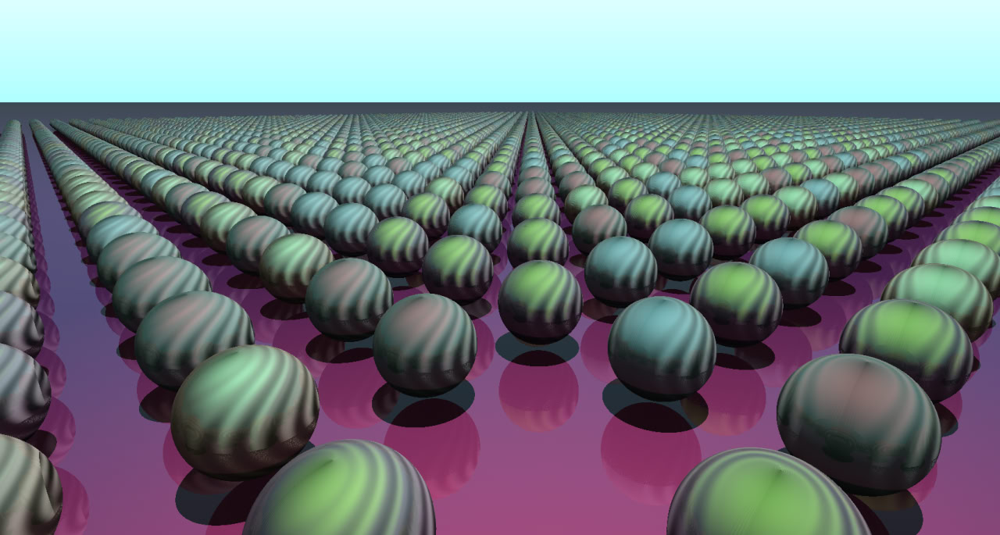

# KHORS: Kinematic Hybrid Optimized Ray System
> UCU-CS: Architectures of Computer Systems project
- Taras Levytskyi




# Requirements
- CMake >= 3.15 (tested on 3.28)
- GCC >= 10 (tested on 14.2)
- Make (tested on 4.3)
- OpenGL

# Installation
Clone the repository
```
git clone https://github.com/llevttarr/khors-ray-tracer.git
cd khors-ray-tracer
```
Then, install dependencies

Ubuntu:
```
sudo apt update
sudo apt install -y cmake build-essential make libgl1-mesa-dev xorg-dev 
```

# Usage
First, compile the project
```
cd build
cmake ..
make
```
Run the ray-tracer program
```
./KHORS_RayTracer
```