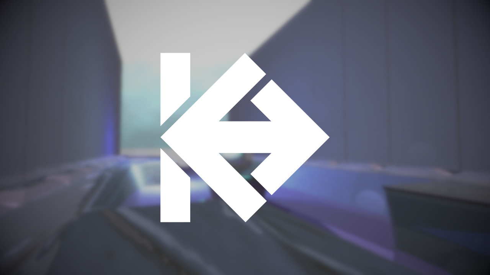
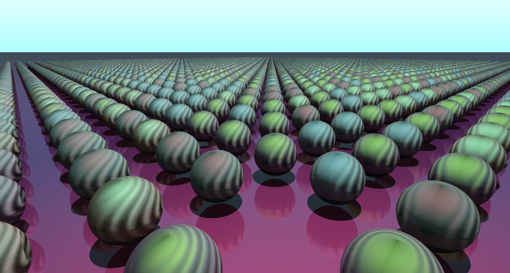
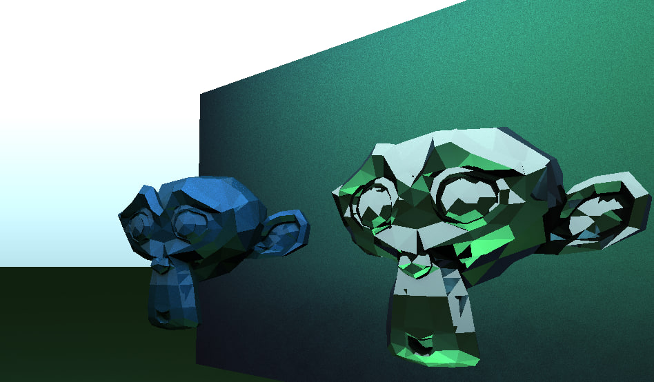
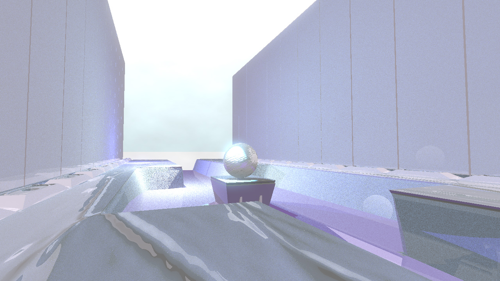

# KHORS: Kinematic Hybrid Optimized Ray System



[Project report](static/khors_report.pdf)

# Overview

KHORS is a real-time ray-tracing engine with two backends: one in OpenGL and one in Vulkan, utilizing Reservoir Resampling and hardware acceleration (Vulkan only). It was developed as a part of the Architectures of Computer Systems course at UCU.

<video width="500" height="300" controls>
  <source src="static/khors_demo.mp4" type="video/mp4"> Demo
</video>

# Requirements
- CMake >= 3.24
- GCC >= 11
- Make (tested on 4.3)
- OpenGL
- Vulkan SDK

## Dependencies (automatically installed)
- GLFW
- Dear ImGUI
- Volk
- Shaderc
- glslang
- SPIRV-tools
- glad
- stb_image
- VMA (Vulkan Memory Allocator)

# Installation
Clone the repository
```
git clone https://github.com/llevttarr/khors-ray-tracer.git
cd khors-ray-tracer
```
Then, install dependencies

Ubuntu:
```
sudo apt update
sudo apt install -y cmake build-essential make libgl1-mesa-dev xorg-dev vulkan-tools libvulkan-dev
```

# Usage
First, compile the project
```
cd build
cmake ..
make
```
Run the ray-tracer program
```
./KHORS_RayTracer
```
# Screenshots



